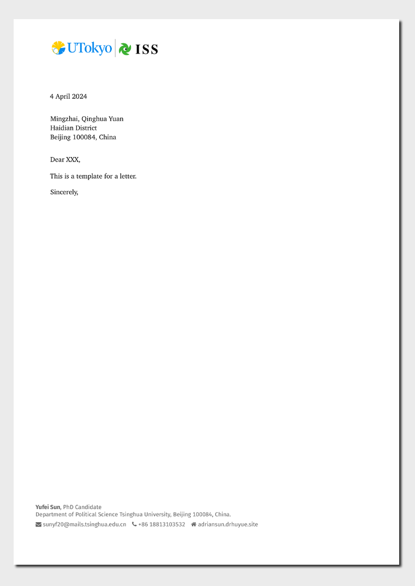

<!-- README.md is generated from README.qmd. Please edit that file -->

# UTokyo ISS Letter Format Template

This Quarto template facilitates the creation of letters using the
letterhead of the Institute of Social Science (ISS) at the University of
Tokyo (UTokyo). It features the modern “UTokyo” logo, adhering to the
new design philosophy of the university. This template is an adaptation
of the `numbats/monash-quarto-letter` template, customized to meet the
styling and formatting needs of UTokyo, as detailed in [UTokyo’s
branding
guidelines](https://www.u-tokyo.ac.jp/focus/en/features/z1304_00261.html).

## Creating a new letter

To start a new letter with this template, execute the command:

``` bash
quarto use template your-username/UTokyo-ISS-QuartoTemplate-letter
```

This command will install the template and create a `.qmd` file as a
starting point for your letter.

## Installation for existing document

If you wish to apply this letter format to an existing Quarto project or
document, navigate to your project or document directory and run:

``` bash
quarto install extension your-username/UTokyo-ISS-QuartoTemplate-letter
```

This integrates the UTokyo ISS letterhead into your Quarto document or
project, ensuring it reflects the university’s official branding.

## Example

Preview of the template in use:

[](examples/template.pdf)
